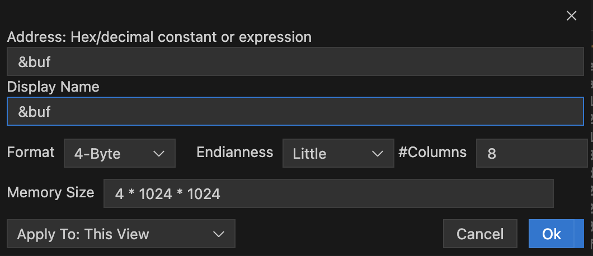

# Change Log

Please note that we are still in Preview mode. For those using the API, this can change in the near future as we refine our proposals but it is getting more mature as it is being used in other extensions.

## [Unreleased]

-   Editing
-   ---Selection, copy &--- paste
-   Apply settings to workspace/user/all-views beyond the current view
-   Scrollbars: We are not happy about the scrollbars. While scrolling works with the track-pad or mouse-wheel, the scrollbars are not always visible. We hope to have proper scrollbars in the future and soon. The infinite scrolling makes scrollbars a bit tricky. Any help is appreciated if you are a HTML/CSS/React expert.

## 0.0.18 - Nov 21, 2022

-   You can now use you mouse to select a range of cells using your mouse. A single left-click starts the selection and Shift-left-click will extend the selection
-   You can also copy the values to the system clipboard using the standard keyboard shortcut or the right-click context menu. When pasted into another application/window, the only the hex values are pasted. Sorry, no paste within the viewer yet -- as that requires editing capabilities in this extension.

## 0.0.17 - Nov 18, 2022

-   Fix for [Issue#9 Data regions are not refreshed synchronously](https://github.com/mcu-debug/memview/issues/9). Needed to force a refresh
-   Fix for when you change the editor font size, the data rows were not being resized accordingly. The data rows are now a tiny bit more compact as well

## 0.0.16 - Nov 12, 2022

-   Partial fix for [Issue#7 Not vertical layout friendly](https://github.com/mcu-debug/memview/issues/7). We still have a big problem with the header not scrolling horizontally with the content but the content is no longer cut-off/shrunk/etc. Experts in CSS/HTML/React are welcome to help us. We will eventually get this right.
-   Some minor changes to editing (sorry not ready yet but you can try editing) and tab navigation

## 0.0.15 - Oct 30, 2022

-   Fix for [Issue#7](https://github.com/mcu-debug/memview/issues/7). One consequence of this is that the vertical scrollbar may not be visible anymore because it is inside and to the far right. If you scroll right far enough, it is there. See note about scrollbars above
-   Some minor changes to editing (sorry not ready yet but you can try editing) and tab navigation

## 0.0.14 - Oct 11, 2022

-   vscode command `mcu-debug.memory-view.addMemoryView` now supports adding with expression and/or other options
-   Avoid duplicate views wither via URI or via mcu-debug.memory-view.addMemoryView. For something to be considered a duplicate, the expression has to match and if they exist as options, the workspaceFolder and the sessionName have to match. Other optional things are not compared.
-   Fixed Issue#1 STM32 memory locations off by 10 bytes. Actually, it was off by 0x10 bytes, bug introduced when we did the display for 4 and 8 byte grouping.

## 0.0.10 - Oct 7, 2022

-   Initial release, moved from haneefdm/memview to mcu-debug/memview

## 0.0.9 - Sep 3, 2022

-   Initial release of most of the view settings. Applying settings more globally is not yet implemented -- until we finalize a per view set of settings.
-   Introducing 4-byte and 8-byte grouping. However, these groupings, you will not get the Decoded bytes. Instead however, you will see 32-bytes of data per row whereas you see 16-bytes per row in 1-byte mode
-   For 4-byte and 8-byte grouping, we also support little/big endian conversion
-   The top-left of a memory view now shows the start-address of the view. Note that this is different from the base-address which is always a multiple of 16. So, you start-address and base-address can be slightly different and base-address <= start-address. The start-address will always be on the first row though.

