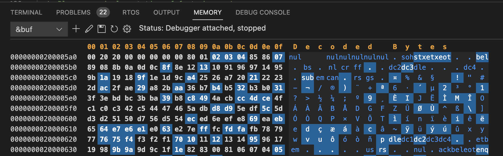
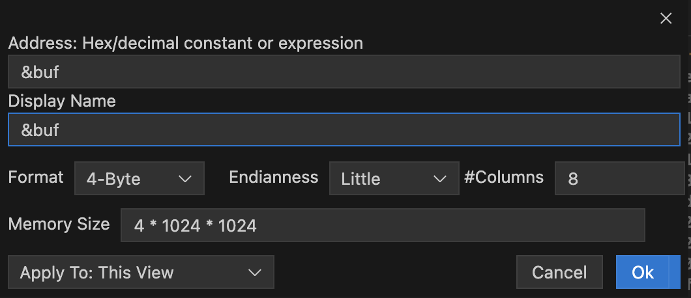

# memview

https://marketplace.visualstudio.com/items?itemName=mcu-debug.memory-view is available as a preview. Please read the following first though.

This is a memory viewer extension specially built to work with debuggers. It can be used with any debugger that supports memory reads (and optional writes). Currently `cppdbg`, `cortex-debug` and `cspy` are the debuggers supported. This extension is more suitable for low level programmers or embedded developers. The debugger has to support the [Debug Adapter Protocol](https://microsoft.github.io/debug-adapter-protocol/). This protocol specifies how to format/make requests and responses. However it does not say what happens when a request fails so there may be issues in failure conditions -- we try our best to recover.

Our goal is to provide a good memory viewer, editing memory is lower in priority. For editing, we have not decided on what the usage paradigm is and how to do error recovery.



## Features

This was originally conceived as part of the [Cortex-Debug](https://github.com/Marus/cortex-debug) extension. But I decided to make it a stand-alone extension so it can be useful for other debuggers. The design thoughts and goals are [documented here](https://github.com/Marus/cortex-debug/wiki/Memory-Viewer)

-   Infinite scroll capable. Currently, artificially limited to 4MB and this may change.
    -   Very little data is fetched depending on what is being viewed and more is loaded as you scroll.
-   1/4/8 byte views. Decoded bytes are only shown in 1-byte mode.
-   Persistent views that survive multiple debug sessions and VSCode restarts.
-   Visually tell which bytes were modified since last 'resume' of a program. Changed cells (byte, word or double-word) are highlighted.
-   One panel hosts multiple views that you can switch between. This was a deliberate choice.
-   Separate views can interfere with the performance of the debug session single stepping because of too much traffic
-   Coming soon: Paste. Selection and copy to clipboard already available.
-   Coming soon: memory editing. You can edit now but there is capability to commit changes to program memory.
-   Coming soon: Ability to host the window either in the 'Panel' area (alongside Debug Console) or in the editor area.
-   Coming soon: We have an issue pending with VSCode for the ability to launch the memory viewer from withing the Variable/Watch Windows. See https://github.com/microsoft/vscode/issues/155597 and **submit your vote**.

Following customizations exist for a memory view<br>


We would like to eventually launch memory views from the Variables and Watch windows. But this will require some cooperation from core VSCode.

## Usage (Manually within VSCode)

-   Use the Command Palette and select `MemoryView: Add new memory view...` while a debug session is paused.
-   It will ask you for an address or a C-style expression that can be interpreted by the debugger to return an address. In expressions, try to use global variables or else things might not work when we try to refresh the view
-   When successfully attached, a `MEMORY` tab will appear in the Panel area
-   All memory requests are aligned to a 16 byte boundary. The number of bytes is limited to 1MB but only 512 byte chucks are read and we only keep a small amount (two pages) of data in memory. Memory is fetched and rendered as need

-   NOTE: Editing features are not yet ready for use. You can edit but the edits will not be saved to your program

Your views are preserved across restarts of VSCode window. They are saved on a workspace basis. We have three states for a memory view

-   `Orphaned`: Not connected to a debugger and will display the last seen values if they were ever extracted. Every time a new debug session starts (of the supported debuggers), we try to see if an orphaned memory view can be re-attached to the session. You will see an indication of that in the toolbar.
-   `Busy`: Attached to the debugger but the program is busy. While it is busy, no updates to memory views can happen, while it is possible to read memory while the program is running, most gdb based debuggers do not allow this and we don't know which debuggers are capable of that.
-   **`Paused`**: The program is in paused state and we are ready to update memory. A refresh is automatically done for visible areas and more data is fetched as needed. When a refresh occurs and there is previous data available, changed areas are marked as seen in the screenshot above

## Usage (Manually from a browser)

You can enter URL that of the form vscode://mch-debug.memory-view/ADDRESS-OR-EXPRESSION to open a new view (best done when the debugger is in paused state). For instance entering vscode://mcu-debug.memory-view/0x20000670 will open a view for address 0x20000670. All the options mentioned in the section below also apply

## Usage (programmatically by another extension)

-   We can provide an API and it is planned and we will implement as soon as there is some extension that needs it.
-   Any extension can create a memory view using the VSCode API to open a URI. The first extension to use it will probably be Cortex-Debug and this will be refined as needed
-   Please don't use this in production yet until the API is deemed ready. Feel free to experiment.

```typescript
const options: MemviewUriOptions = {
    expr: '&buf'
};
const uri = vscode.Uri.from({
    scheme: vscode.env.uriScheme,
    authority: 'mcu-debug.memory-view',
    path: '/' + encodeURIComponent('&buf'), // Use any expression or hex or decimal constant here
    query: querystring.stringify(options as any)
});
vscode.env.openExternal(uri).then((success: boolean) => {
    // Of course you would not be using console.log, but you get the point
    // One problem right now is that it always seems to succeed even when a view did
    // not start successfully. Please let us know of issues and we will figure it out
    console.log(`Operation URI open: success=${success}`);
}),
    (e: any) => {
        console.error(e);
    };
```

The interface for options is as follows

```typescript
/**
 * Proposed API
 *
 * It is best to add a new memory view when a debug session is active and in stopped
 * status. Otherwise, there has to be a lot of guessing and we may not always get it right
 * or get it right immediately.
 *
 * Note that once we match a memory view with a debug session, we start tracking it for
 * future invocations and automatically bind to a new session. Of course, this can fail
 * if the session name changes or workspace folder changes.
 */
export interface MemviewUriOptions {
    /**
     * `memoryReference` is what a debug adapter provides. It is an opaque string representing a location in memory.
     * If this exists, we use it if the there is no `expr`, or if you have an `expr` as a fallback memory location.
     * This is generally provided by automated tools and not something to be manually entered.
     */
    memoryReference?: string;

    /**
     * `expr` can be a constant memory address or an expression resulting in an address by debugger using evaluate().
     * URI path is used if no expr is specified
     */
    expr?: string;

    /**
     * We try to derive most of the following if not specified. If sessionId is specified, it should
     * be a currently running debugger (may not be active session). When we can't match the active
     * debug session with what the sessionId given, we may defer to until later.
     */
    sessionId?: string | 'current'; // Undefined also means 'current' if there is an active session

    /** If not supplied, use `expr` or `memoryReference` or the URI path */
    displayName?: string;

    /**
     * Following two can be used for better matching of an inactive memory view with a later active
     * debug session. Unfortunately, that only works when the debugger starts a new session
     */

    /** Session name for better matching with a future debug session. */
    sessionName?: string;

    /** Workspace folder associated with the debug session for better matching with a future debug session. */
    wsFolder?: string; // Must be a Uri.toString() of an actual wsFolder for the session
}
```

There is also a command you can be used to add a new memory view. This may be safer in remote environments where vscode.env.openExternal can potentially fail. We have defined a command as follows

```typescript
    vscode.commands.registerCommand('mcu-debug.memory-view.addMemoryView', (constOrExprOrMemRef?: string, opts?: MemviewUriOptions);
```

If no arguments are given, user will be promoted for an expression. This command will do the same thing as what a Uri Handler does but maybe easier to use. We ourselves are going to use this method -- which can fail if the Memory View is not yet installed.

There are a few challenges here `memview` is not built into a debugger and thus does not know the exact status. It does its best to track existing debug sessions -- note that there can be multiple debug sessions going on concurrently and they can be in various stages.
